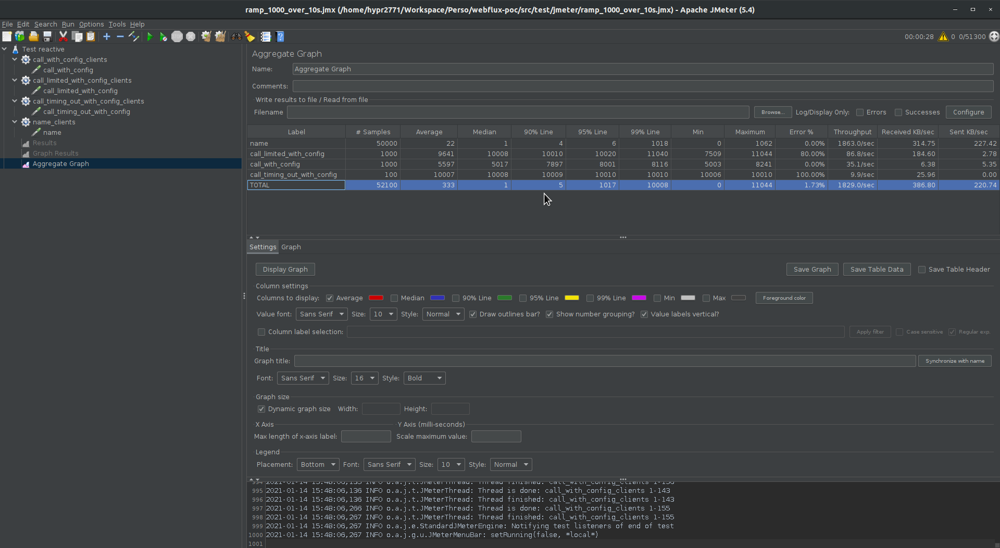
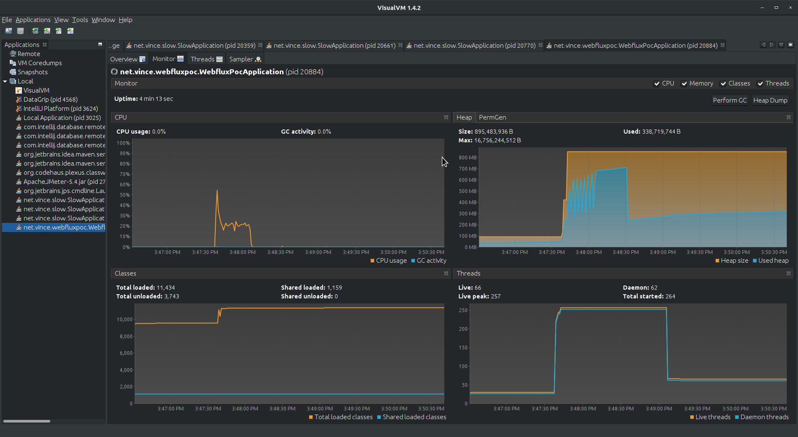

## Our issue

We are a proxy++, so we should be able to forward any requests made against our service to the
target, which means that we _should never_ limit the proxy client if his target is not a limited
service.

For instance, if the proxy client wants to call `example.org` through us, we have to forward his
requests as long as `example.org` is answering us.

### Motto

This gives us our motto:

> We should not limit the proxy client to a limitation of our own platform.

## WebFlux usage

### Scenarii

Stress test scenario was split in 3 scenarii:

- A: 1000 users requesting at the same time to call a 5 seconds delay service handling 200 simultaneous requests maximum through the proxy, once
- B: 200 users requesting at the same time to call a 5 seconds delay service handling 200 simultaneous requests maximum through the proxy, 5 times in a row
- C: 200 users requesting at the same time to call a 20 seconds delay service handling 200 simultaneous requests maximum through the proxy, once
- D: 50000 users requesting at the same time an info on the proxy API, once

All those scenarii are expecting a response in 10 seconds before considering an error.

### Expectations

What we expect from WebFlux is that:

- A answers to the first 200 in more than 5 seconds, then client times out for the rest of the requests (80% error)
- B answers to each request in more 5 seconds, no client times out (0% error)
- C times out for each request (100% error)
- D answers to each request in a very short delay

### Verdict

We can see that this answers perfectly our needs.
These tests were made locally but exhibits that the technology is the one we need.

### State of the proxy

Just to validate that everything works without catching fire, we can see that nothing is scary, the
CPU worked to compute the workflow and let RAM and reactor threads handling the events.

## Reproducing

- checkout this project
- create a database `webflux_poc` at `localhost:5432` with username `postgres` and password `admin`
- run the `WebFluxPocApplication`
- run 3 [slow service](https://github.com/hypr2771/slow) on port `8081`, `8082` and `8083`
- run `mvn clean verify` to run the stress tests
- check results in `target/jmeter/results/<prefix>-ramp_1000_over_10s.csv`
